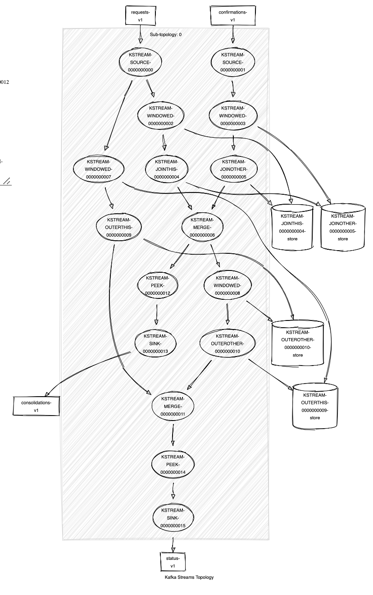

# PoC consolidating streams: request and confirm

## Specific
1. Join is key-based
2. [Join types](https://docs.confluent.io/current/streams/developer-guide/dsl-api.html#kstream-kstream-join): inner, left, outer

A windowing state store is used to store all the records received so far within the defined window boundary. 
In aggregating operations, a windowing state store is used to store the latest aggregation results per window. 
Old records in the state store are purged after the specified window retention period. 
Kafka Streams guarantees to keep a window for at least this specified time; the default value is one day and can be changed via `Materialized#withRetention()`.

## Requirements
1. Co-partitions topics
2. Always window (KStream -> KStream)

### Diagram stream processing


### Topology stream processing
Upload [here](https://zz85.github.io/kafka-streams-viz/)

```
Topologies:
   Sub-topology: 0
    Source: KSTREAM-SOURCE-0000000000 (topics: [requests-v1])
      --> KSTREAM-WINDOWED-0000000002, KSTREAM-WINDOWED-0000000007
    Source: KSTREAM-SOURCE-0000000001 (topics: [confirmations-v1])
      --> KSTREAM-WINDOWED-0000000003
    Processor: KSTREAM-WINDOWED-0000000002 (stores: [KSTREAM-JOINTHIS-0000000004-store])
      --> KSTREAM-JOINTHIS-0000000004
      <-- KSTREAM-SOURCE-0000000000
    Processor: KSTREAM-WINDOWED-0000000003 (stores: [KSTREAM-JOINOTHER-0000000005-store])
      --> KSTREAM-JOINOTHER-0000000005
      <-- KSTREAM-SOURCE-0000000001
    Processor: KSTREAM-JOINOTHER-0000000005 (stores: [KSTREAM-JOINTHIS-0000000004-store])
      --> KSTREAM-MERGE-0000000006
      <-- KSTREAM-WINDOWED-0000000003
    Processor: KSTREAM-JOINTHIS-0000000004 (stores: [KSTREAM-JOINOTHER-0000000005-store])
      --> KSTREAM-MERGE-0000000006
      <-- KSTREAM-WINDOWED-0000000002
    Processor: KSTREAM-MERGE-0000000006 (stores: [])
      --> KSTREAM-WINDOWED-0000000008, KSTREAM-PEEK-0000000012
      <-- KSTREAM-JOINTHIS-0000000004, KSTREAM-JOINOTHER-0000000005
    Processor: KSTREAM-WINDOWED-0000000007 (stores: [KSTREAM-OUTERTHIS-0000000009-store])
      --> KSTREAM-OUTERTHIS-0000000009
      <-- KSTREAM-SOURCE-0000000000
    Processor: KSTREAM-WINDOWED-0000000008 (stores: [KSTREAM-OUTEROTHER-0000000010-store])
      --> KSTREAM-OUTEROTHER-0000000010
      <-- KSTREAM-MERGE-0000000006
    Processor: KSTREAM-OUTEROTHER-0000000010 (stores: [KSTREAM-OUTERTHIS-0000000009-store])
      --> KSTREAM-MERGE-0000000011
      <-- KSTREAM-WINDOWED-0000000008
    Processor: KSTREAM-OUTERTHIS-0000000009 (stores: [KSTREAM-OUTEROTHER-0000000010-store])
      --> KSTREAM-MERGE-0000000011
      <-- KSTREAM-WINDOWED-0000000007
    Processor: KSTREAM-MERGE-0000000011 (stores: [])
      --> KSTREAM-PEEK-0000000014
      <-- KSTREAM-OUTERTHIS-0000000009, KSTREAM-OUTEROTHER-0000000010
    Processor: KSTREAM-PEEK-0000000012 (stores: [])
      --> KSTREAM-SINK-0000000013
      <-- KSTREAM-MERGE-0000000006
    Processor: KSTREAM-PEEK-0000000014 (stores: [])
      --> KSTREAM-SINK-0000000015
      <-- KSTREAM-MERGE-0000000011
    Sink: KSTREAM-SINK-0000000013 (topic: consolidations-v1)
      <-- KSTREAM-PEEK-0000000012
    Sink: KSTREAM-SINK-0000000015 (topic: status-v1)
      <-- KSTREAM-PEEK-0000000014
```