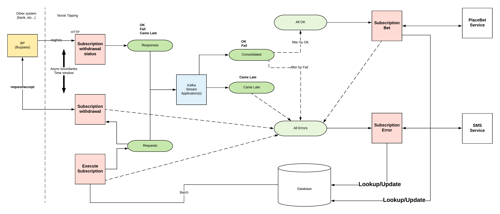

# PoC consolidating streams: request and confirm(response)

## Case specific
1. `Request` sent, receives `Response` with `confirmation` OK or FAIL status, within time window for processing(join)
2. `Request` sent, receives `Response` with `confirmation` OK or FAIL status, but after time-out(INTERNAL) for time window for processing(join) 
3. `Request` sent, `Response` with`confirmation` never arrived 

Making stateful operations with kafka streams must always windowed. 
-> That is reason, why we can not track requests without responses.
We assume that `late response` is equal to `never-come response`, 
`NB!` but these two cases have different side affect on Bypass, which is ok and handling of these cases are delegated to Bypass service.   

## Questions
1. Which Window type use for stateful operations ? (Currently it is `sliding window` based on record timestamp)

## Unresolved problem
1. How to track `Requests` without `Responses` (assume that `late response` is equal to `never-come response`) 

### Requirements
1. Co-partitions topics
2. Always window (KStream -> KStream)

Other: 
1. Join is key-based
2. [Join types](https://docs.confluent.io/current/streams/developer-guide/dsl-api.html#kstream-kstream-join): inner, left, outer

A windowing state store is used to store all the records received so far within the defined window boundary. 
In aggregating operations, a windowing state store is used to store the latest aggregation results per window. 
Old records in the state store are purged after the specified window retention period. 
Kafka Streams guarantees to keep a window for at least this specified time; the default value is one day and can be changed via `Materialized#withRetention()`.

### Topology stream processing
Upload [here](https://zz85.github.io/kafka-streams-viz/)

### How to run
* [How to run](./how2run.md)